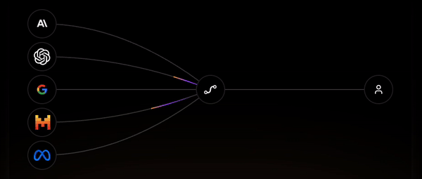

# LLmHub.dev : Unified LLM API for Maximizing performance and Minimizing costs 

## LLmHub.dev - One Month Public Roadmap: Building Optimal Auto Routers for LLMs

#### **Week 1: Foundation & Strategy (Completed) **
1. **Finalize Product Vision**
   - Define the core objective: maximizing LLM performance and minimizing costs via auto routers.
   - Establish key metrics (latency, model cost efficiency, success rates).
   - Draft user personas (who will use the auto-routing API? E.g., researchers, enterprises).

2. **Competitor Analysis**
   - Analyze competing LLM routing solutions in terms of performance, cost, and use cases.
   - Identify gaps in the market and opportunities for differentiation.

3. **Design Auto Router Architecture**
   - Determine routing strategies (e.g., by input complexity, token length, task type).
   - Choose algorithms to handle load balancing and model selection dynamically.
   - Prioritize foundational models and criteria for routing (open-source vs. paid models).

4. **Resource Allocation**
   - Define team roles (developers, ML engineers, product managers, data scientists).
   - Allocate workstreams (research, development, testing).
   - Establish a cloud infrastructure budget for LLM testing (AWS, Azure).

---

#### **Week 2: Development Begins**
1. **Backend Development**
   - Set up the API framework using Next.js, React, and relevant backend services.
   - Integrate LLM models into the API (GPT, PaLM, open-source models).
   - Implement routing logic (early version of the auto-router).

2. **Routing Algorithm Testing**
   - Start with basic routing rules (e.g., model efficiency, input-output complexity).
   - Test routing decisions on various user input scenarios (chatbots, NLP tasks, etc.).
   - Collect performance metrics (latency, cost per model call).

3. **Performance Monitoring Setup**
   - Create dashboards (via Grafana or similar tools) to monitor LLM usage, costs, and performance.
   - Implement alerts for routing inefficiencies (e.g., model selection fails, over-cost scenarios).

---

#### **Week 3: Refining & Expanding**
1. **Optimize Router Logic**
   - Begin optimizing based on Week 2 metrics (speed, cost per output).
   - Introduce model pruning strategies (e.g., eliminating underperforming models from the pool).
   - Implement fallback mechanisms to reroute requests if models fail.

2. **Integration with Multiple APIs**
   - Integrate APIs of foundational models beyond initial selections (Claude, LLaMA).
   - Expand routing logic to include more sophisticated task-based decision-making (e.g., specialized tasks like summarization or coding prompts).

3. **Security & Compliance**
   - Implement necessary security protocols for API access and data handling.
   - Ensure compliance with data privacy regulations (GDPR, CCPA).

4. **Stress Testing**
   - Conduct load tests to simulate multiple users and high-demand scenarios.
   - Benchmark auto-routing performance under stress (response times, model selection accuracy).

---

#### **Week 4: Finalization & Launch**
1. **Fine-Tuning & Bug Fixes**
   - Review and fix any outstanding issues discovered during testing.
   - Fine-tune routing performance to minimize cost per call while ensuring quality results.
   - Ensure redundancy and failover in case a model is unavailable.

2. **Documentation**
   - Prepare API documentation for developers, including integration steps, endpoint usage, and routing logic.
   - Write user guides detailing the benefits of the auto router, and how it optimizes cost and performance.

3. **Launch & Outreach**
   - Launch the MVP (Minimum Viable Product) of the auto router.
   - Reach out to beta testers (early adopters, potential clients) for feedback.
   - Start marketing efforts (product website, presentations to potential users).

4. **Future Planning**
   - Collect initial feedback and usage metrics.
   - Begin preparing the roadmap for the next phase: scaling, adding more models, optimizing further.

---

### Key Deliverables:
- **Week 1:** Product vision, architecture, competitor analysis.
- **Week 2:** Basic routing logic, integration, and early testing.
- **Week 3:** Optimized routing logic, security, stress tests.
- **Week 4:** Fine-tuning, documentation, product launch, feedback gathering.
