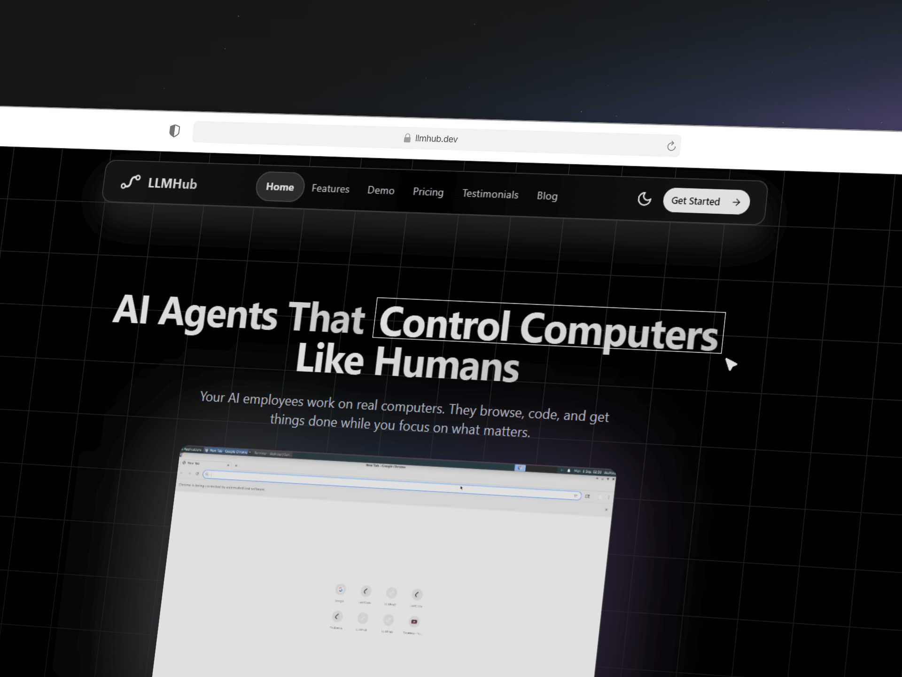

# LLMHUB.dev

**Autonomous computer agents at scale**

LLMHUB.dev builds autonomous computer control agents designed for performance, efficiency, and scalability.  
Our platform enables seamless integration of intelligent agents that execute complex workflows reliably.

---

## What We Do
- Build autonomous agents that can control and manage computer systems  
- Scale efficiently to handle enterprise-level tasks  
- Provide a simple and unified interface for developers  

---

## Preview

  

---

## Learn More
Visit us at [LLMHUB.dev](https://llmhub.dev)
